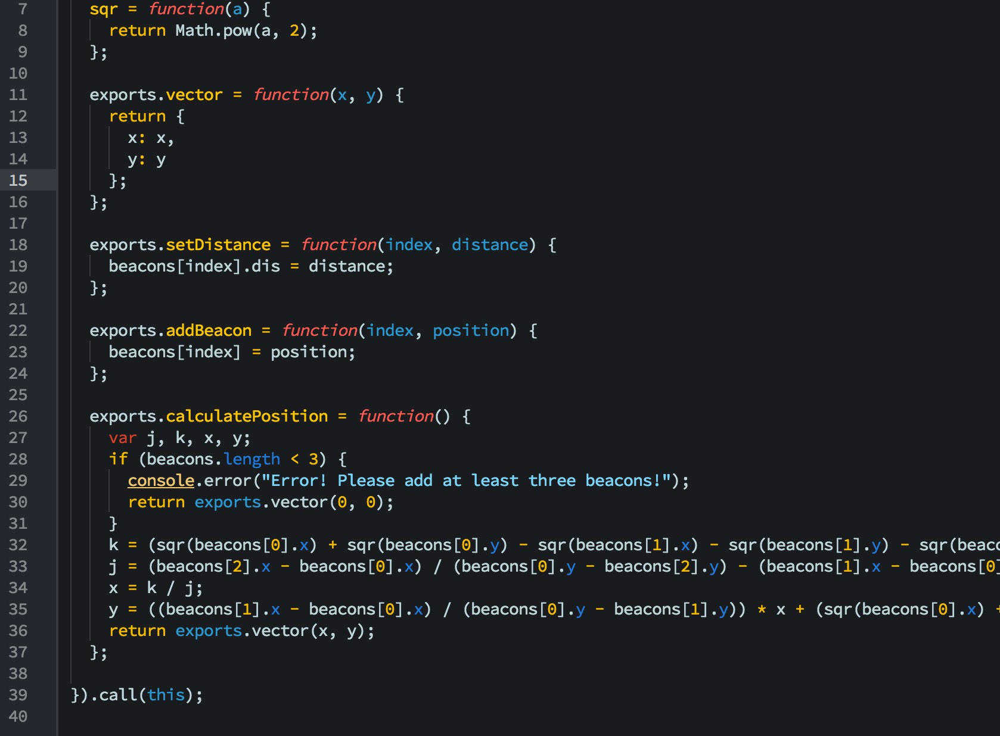

# Adventure Zed

> A vibrant, Adventure Time inspired theme for [Zed](https://zed.dev) editor based on the Adventurous Syntax color palette.

## Palette Overview

- **Background**: `#191B1F`
- **Text / Foreground**: `#BFD7DB`
- **Functions & Tags**: `#FFC620` (Hyperactive / Rawr)
- **Control Keywords & Numbers**: `#F5BB12` (Energetic / Jake the Dog)
- **Keywords & Storage**: `#D3422E` (Posh / Peppermint Butler)
- **Types & Classes**: `#4BAE16` (Positive / Finn's Bag)
- **Strings**: `#7fd6fa` (Cold / Ice King)
- **Constants & Titles**: `#277BD3` (Intensive / Finn the Human)
- **Language Constants & Booleans**: `#de347a` (Important / Princess)
- **Variables & Properties**: `#3299CC` (Passive / Adventure Time)
- **Comments**: `#404449` (Ghostly)

## Install

Refer to [INSTALL.md](./INSTALL.md) for full installation instructions.

## License

[MIT License](./LICENSE)
